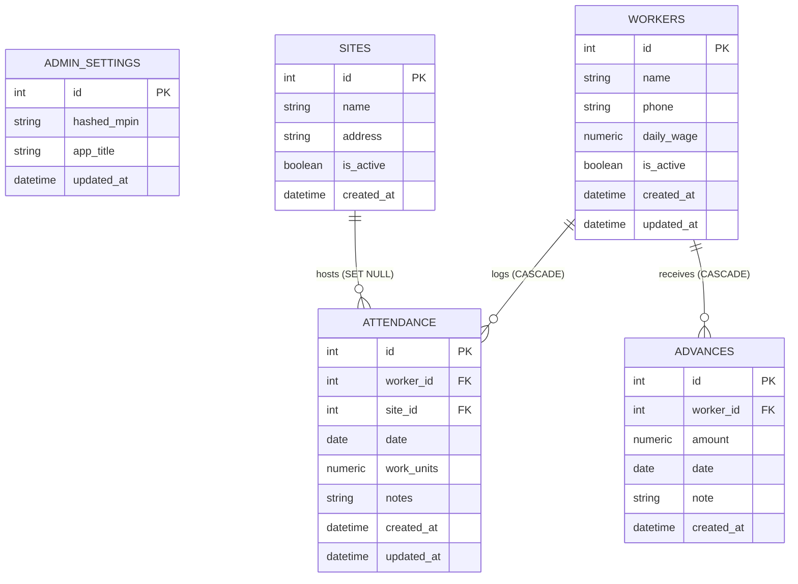

# Attendly — Database Architecture & Schema Reference

Attendly uses **PostgreSQL** as its relational database, managed via **SQLAlchemy 2.0** ORM. In production, the database is hosted on **Neon Serverless PostgreSQL** with encrypted SSL pooled connections.

---

## Entity-Relationship Diagram



---

## Tables & Schema Definitions

### 1. `admin_settings`
Stores the contractor's hashed MPIN and application preferences.

| Column | Type | Constraints | Description |
| :--- | :--- | :--- | :--- |
| `id` | `INTEGER` | `PRIMARY KEY`, Index | Single configuration row identifier. |
| `hashed_mpin` | `VARCHAR(255)` | `NOT NULL` | Bcrypt hashed admin login PIN. |
| `app_title` | `VARCHAR(100)` | Default: `'Attendly'` | Header brand label. |
| `updated_at` | `TIMESTAMP` | Auto-update on modification | Timestamp of last PIN change. |

---

### 2. `workers`
Registry of trade labor personnel.

| Column | Type | Constraints | Description |
| :--- | :--- | :--- | :--- |
| `id` | `INTEGER` | `PRIMARY KEY`, Index | Unique worker identifier. |
| `name` | `VARCHAR(120)` | `NOT NULL`, Index | Full name of the worker. |
| `phone` | `VARCHAR(30)` | `NULLABLE` | Contact phone number (used for direct calls). |
| `daily_wage` | `NUMERIC(10, 2)` | `NOT NULL`, Default: `0.00` | Standard daily wage rate in INR. |
| `is_active` | `BOOLEAN` | `NOT NULL`, Default: `TRUE`, Index | Active status. Inactive workers are excluded from muster rolls. |
| `created_at` | `TIMESTAMP` | Default: `UTC NOW` | Profile creation timestamp. |
| `updated_at` | `TIMESTAMP` | Auto-update on modification | Last profile update timestamp. |

**Relationships:**
- `attendances`: 1-to-Many with `Attendance` (`cascade="all, delete-orphan"`).
- `advances`: 1-to-Many with `Advance` (`cascade="all, delete-orphan"`).

---

### 3. `sites`
Registry of active and completed construction project sites.

| Column | Type | Constraints | Description |
| :--- | :--- | :--- | :--- |
| `id` | `INTEGER` | `PRIMARY KEY`, Index | Unique site identifier. |
| `name` | `VARCHAR(150)` | `NOT NULL`, Index | Name of project site (e.g., `'Apex Tower B7'`). |
| `address` | `VARCHAR(255)` | `NULLABLE` | Physical location or landmark. |
| `is_active` | `BOOLEAN` | `NOT NULL`, Default: `TRUE`, Index | Active status. Inactive sites remain available in historical analytics. |
| `created_at` | `TIMESTAMP` | Default: `UTC NOW` | Site creation timestamp. |

**Relationships:**
- `attendances`: 1-to-Many with `Attendance` (Foreign key configured with `ON DELETE SET NULL`).

---

### 4. `attendance`
Daily labor muster log capturing work performed by each worker on each date.

| Column | Type | Constraints | Description |
| :--- | :--- | :--- | :--- |
| `id` | `INTEGER` | `PRIMARY KEY`, Index | Unique attendance record ID. |
| `worker_id` | `INTEGER` | `NOT NULL`, FK &rarr; `workers.id` (CASCADE), Index | Assigned worker. |
| `site_id` | `INTEGER` | `NULLABLE`, FK &rarr; `sites.id` (SET NULL), Index | Site where work was performed. |
| `date` | `DATE` | `NOT NULL`, Index | Work date. |
| `work_units` | `NUMERIC(3, 1)` | `NOT NULL`, Default: `1.0` | Exact work-unit logged (`0.0`, `0.5`, `1.0`, `1.5`, `2.0`). |
| `notes` | `VARCHAR(255)` | `NULLABLE` | Shift notes (e.g. `'Overtime pour'`, `'Departed early'`). |
| `created_at` | `TIMESTAMP` | Default: `UTC NOW` | Record creation timestamp. |
| `updated_at` | `TIMESTAMP` | Auto-update on modification | Record modification timestamp. |

**Composite Unique Constraint:**
- `uq_worker_attendance_date`: `UNIQUE (worker_id, date)` ensures that a worker cannot have more than one attendance record on any single date. Saving daily muster updates existing records in place.

---

### 5. `advances`
Transaction ledger of cash or electronic payments disbursed to workers ahead of payroll.

| Column | Type | Constraints | Description |
| :--- | :--- | :--- | :--- |
| `id` | `INTEGER` | `PRIMARY KEY`, Index | Unique advance transaction ID. |
| `worker_id` | `INTEGER` | `NOT NULL`, FK &rarr; `workers.id` (CASCADE), Index | Recipient worker. |
| `amount` | `NUMERIC(10, 2)` | `NOT NULL`, Default: `0.00` | Advance amount in INR. Must be `> 0`. |
| `date` | `DATE` | `NOT NULL`, Index | Date payment was disbursed. |
| `note` | `VARCHAR(255)` | `NULLABLE` | Description or payment method (e.g. `'Cash site box'`, `'UPI'`). |
| `created_at` | `TIMESTAMP` | Default: `UTC NOW` | Transaction timestamp. |

---

## Mathematical & Financial Calculations

### 1. Worker Gross Earnings (Monthly)
For worker $w$ over month $M$:
$$\text{Gross}(w, M) = \sum_{a \in \text{Attendance}(w, M)} \left( a.\text{work\_units} \times w.\text{daily\_wage} \right)$$

### 2. Worker Advances (Monthly)
$$\text{Advances}(w, M) = \sum_{v \in \text{Advances}(w, M)} v.\text{amount}$$

### 3. Worker Net Payable
$$\text{Net Payable}(w, M) = \text{Gross}(w, M) - \text{Advances}(w, M)$$

### 4. Project Site Labor Cost
For site $S$ over month $M$:
$$\text{Site Expense}(S, M) = \sum_{a \in \text{Attendance}(S, M, \text{units} > 0)} \left( a.\text{work\_units} \times a.\text{worker}.\text{daily\_wage} \right)$$

---

## Data Integrity & Preservation Policies

1. **Site Deletion Protection**:
   - Deleting a site that has associated historical attendance records is prohibited by backend business logic (`HTTP 400`).
   - Contractors must deactivate the site instead (`is_active = FALSE`). This ensures that past site cost analytics remain mathematically accurate.
2. **Worker Deactivation**:
   - Marking a worker inactive removes them from daily muster rolls while preserving all past attendance records, advance entries, and payroll records.
3. **Payroll Settlement**:
   - Settle operations archive the period totals without deleting raw attendance or advance rows.
4. **Foreign Key Integrity**:
   - If a worker is deleted, associated attendances and advances are deleted (`CASCADE`).
   - If a site is deleted (only permitted if 0 attendance records exist), any dangling foreign keys are set to `NULL` (`SET NULL`).

---

## Schema Synchronization

Schema initialization is performed automatically when the FastAPI backend starts up:
```python
# backend/app/main.py
@asynccontextmanager
async def lifespan(app: FastAPI):
    try:
        Base.metadata.create_all(bind=engine)
    except Exception as e:
        print(f"Database initialization warning: {e}")
    yield
```
This ensures new tables are automatically provisioned on serverless PostgreSQL instances without requiring manual bootstrap steps.
