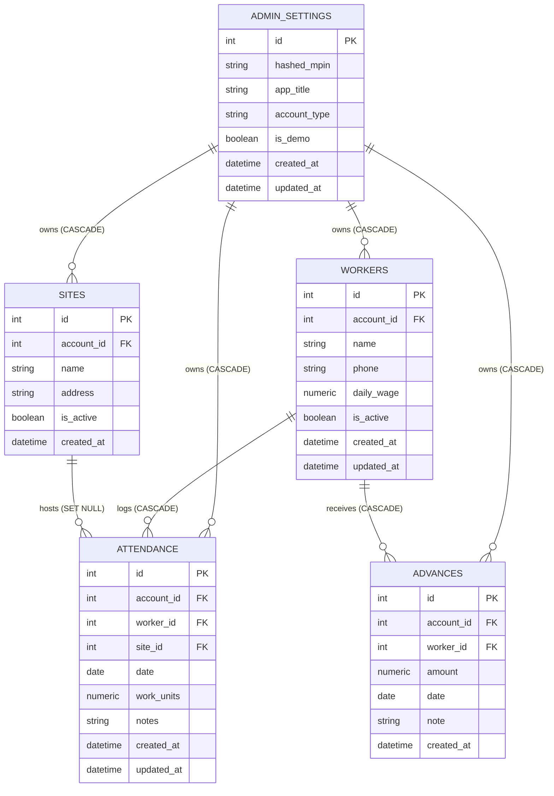

# Attendly — Database Architecture & Schema Reference

Attendly uses **PostgreSQL** as its relational database, managed via **SQLAlchemy 2.0** ORM. In production, the database is hosted on **Neon Serverless PostgreSQL** with encrypted SSL pooled connections.

---

## Multi-Account Architecture & Tenant Isolation

Attendly supports secure multi-account isolation:
1. **Production Account (`account_id: 1`)**: The live contractor/Dad account containing all real labor rosters, sites, attendance records, advances, and payroll history. Protected by a 4-digit MPIN stored only as a salted Bcrypt hash in PostgreSQL.
2. **Demo Account (`account_id: 2`)**: A sandboxed recruiter/evaluator account initialized with realistic, fictional data. Evaluators click "Try Demo", receive a demo-scoped JWT, and explore all application functionality without exposing or modifying real production records.

Every business entity (`workers`, `sites`, `attendance`, `advances`) has a foreign key `account_id` referencing `admin_settings(id)` with a dedicated database index. All FastAPI backend endpoints extract `current_account` from the verified JWT payload and enforce `account_id == current_account.id` on every query, insert, update, and delete.

---

## Entity-Relationship Diagram

---

## Tables & Schema Definitions

### 1. `admin_settings`
Stores account profiles, tenant configuration, and Bcrypt hashed credentials.

| Column | Type | Constraints | Description |
| :--- | :--- | :--- | :--- |
| `id` | `INTEGER` | `PRIMARY KEY`, Index | Unique account identifier (`1` = Dad/Production, `2` = Demo). |
| `hashed_mpin` | `VARCHAR(255)` | `NULLABLE` | Bcrypt hashed MPIN. `NULL` for demo accounts. |
| `app_title` | `VARCHAR(100)` | Default: `'Attendly'` | Header brand label for the account. |
| `account_type` | `VARCHAR(50)` | `NOT NULL`, Default: `'admin'` | Account persona: `'admin'` or `'demo'`. |
| `is_demo` | `BOOLEAN` | `NOT NULL`, Default: `FALSE`, Index | `TRUE` if account is a sandboxed evaluation account. |
| `created_at` | `TIMESTAMP` | Default: `UTC NOW` | Account provisioning timestamp. |
| `updated_at` | `TIMESTAMP` | Auto-update on modification | Timestamp of last configuration change. |

---

### 2. `workers`
Registry of trade labor personnel scoped to an account.

| Column | Type | Constraints | Description |
| :--- | :--- | :--- | :--- |
| `id` | `INTEGER` | `PRIMARY KEY`, Index | Unique worker identifier. |
| `account_id` | `INTEGER` | `NOT NULL`, FK &rarr; `admin_settings.id` (CASCADE), Index | Owning tenant account ID. |
| `name` | `VARCHAR(120)` | `NOT NULL`, Index | Full name of the worker. |
| `phone` | `VARCHAR(30)` | `NULLABLE` | Contact phone number (used for direct calls). |
| `daily_wage` | `NUMERIC(10, 2)` | `NOT NULL`, Default: `0.00` | Standard daily wage rate in INR. |
| `is_active` | `BOOLEAN` | `NOT NULL`, Default: `TRUE`, Index | Active status. Inactive workers are excluded from muster rolls. |
| `created_at` | `TIMESTAMP` | Default: `UTC NOW` | Profile creation timestamp. |
| `updated_at` | `TIMESTAMP` | Auto-update on modification | Last profile update timestamp. |

**Relationships:**
- `attendances`: 1-to-Many with `Attendance` (`cascade="all, delete-orphan"`).
- `advances`: 1-to-Many with `Advance` (`cascade="all, delete-orphan"`).

---

### 3. `sites`
Registry of active and completed construction project sites scoped to an account.

| Column | Type | Constraints | Description |
| :--- | :--- | :--- | :--- |
| `id` | `INTEGER` | `PRIMARY KEY`, Index | Unique site identifier. |
| `account_id` | `INTEGER` | `NOT NULL`, FK &rarr; `admin_settings.id` (CASCADE), Index | Owning tenant account ID. |
| `name` | `VARCHAR(150)` | `NOT NULL`, Index | Name of project site (e.g., `'Apex Tower B7'`). |
| `address` | `VARCHAR(255)` | `NULLABLE` | Physical location or landmark. |
| `is_active` | `BOOLEAN` | `NOT NULL`, Default: `TRUE`, Index | Active status. Inactive sites remain available in historical analytics. |
| `created_at` | `TIMESTAMP` | Default: `UTC NOW` | Site creation timestamp. |

**Relationships:**
- `attendances`: 1-to-Many with `Attendance` (Foreign key configured with `ON DELETE SET NULL`).

---

### 4. `attendance`
Daily labor muster log capturing work performed by each worker on each date.

| Column | Type | Constraints | Description |
| :--- | :--- | :--- | :--- |
| `id` | `INTEGER` | `PRIMARY KEY`, Index | Unique attendance record ID. |
| `account_id` | `INTEGER` | `NOT NULL`, FK &rarr; `admin_settings.id` (CASCADE), Index | Owning tenant account ID. |
| `worker_id` | `INTEGER` | `NOT NULL`, FK &rarr; `workers.id` (CASCADE), Index | Assigned worker. |
| `site_id` | `INTEGER` | `NULLABLE`, FK &rarr; `sites.id` (SET NULL), Index | Site where work was performed. |
| `date` | `DATE` | `NOT NULL`, Index | Work date. |
| `work_units` | `NUMERIC(3, 1)` | `NOT NULL`, Default: `1.0` | Exact work-unit logged (`0.0`, `0.5`, `1.0`, `1.5`, `2.0`). |
| `notes` | `VARCHAR(255)` | `NULLABLE` | Shift notes (e.g. `'Overtime pour'`, `'Departed early'`). |
| `created_at` | `TIMESTAMP` | Default: `UTC NOW` | Record creation timestamp. |
| `updated_at` | `TIMESTAMP` | Auto-update on modification | Record modification timestamp. |

**Composite Constraints & Indices:**
- `uq_worker_attendance_date`: `UNIQUE (worker_id, date)` ensures that a worker cannot have more than one attendance record on any single date.
- Composite index on `(account_id, date)` accelerates month-range muster roll queries.

---

### 5. `advances`
Transaction ledger of cash or electronic payments disbursed to workers ahead of payroll.

| Column | Type | Constraints | Description |
| :--- | :--- | :--- | :--- |
| `id` | `INTEGER` | `PRIMARY KEY`, Index | Unique advance transaction ID. |
| `account_id` | `INTEGER` | `NOT NULL`, FK &rarr; `admin_settings.id` (CASCADE), Index | Owning tenant account ID. |
| `worker_id` | `INTEGER` | `NOT NULL`, FK &rarr; `workers.id` (CASCADE), Index | Recipient worker. |
| `amount` | `NUMERIC(10, 2)` | `NOT NULL`, Default: `0.00` | Advance amount in INR. Must be `> 0`. |
| `date` | `DATE` | `NOT NULL`, Index | Date payment was disbursed. |
| `note` | `VARCHAR(255)` | `NULLABLE` | Description or payment method (e.g. `'Cash site box'`, `'UPI'`). |
| `created_at` | `TIMESTAMP` | Default: `UTC NOW` | Transaction timestamp. |

---

## Mathematical & Financial Calculations

### 1. Worker Gross Earnings (Monthly)
For worker $w$ in account $A$ over calendar month $M$:
$$\text{Gross}(w, M) = \sum_{a \in \text{Attendance}(w, M, A)} \left( a.\text{work\_units} \times w.\text{daily\_wage} \right)$$

### 2. Worker Advances (Monthly)
$$\text{Advances}(w, M) = \sum_{v \in \text{Advances}(w, M, A)} v.\text{amount}$$

### 3. Worker Net Payable
$$\text{Net Payable}(w, M) = \text{Gross}(w, M) - \text{Advances}(w, M)$$

### 4. Project Site Labor Cost
For site $S$ in account $A$ over calendar month $M$:
$$\text{Site Expense}(S, M) = \sum_{a \in \text{Attendance}(S, M, A, \text{units} > 0)} \left( a.\text{work\_units} \times a.\text{worker}.\text{daily\_wage} \right)$$

---

## Data Integrity & Isolation Guarantees

1. **Strict Tenant Scoping**:
   - Every read and write query in the API layer filters by `account_id = current_account.id`.
   - Attempts to access or mutate an object belonging to a different account return `404 Not Found`.
2. **Site Deletion Protection**:
   - Deleting a site that has associated historical attendance records is rejected (`HTTP 400`). Contractors must deactivate the site (`is_active = FALSE`).
3. **Worker Deactivation**:
   - Marking a worker inactive removes them from the active muster roll while preserving historical attendance, advances, and payroll data.
4. **Foreign Key Integrity**:
   - Deleting a worker cascades to their associated attendance and advances (`ON DELETE CASCADE`).
   - Deleting a site (only permitted when no attendance records exist) sets any references to `NULL` (`ON DELETE SET NULL`).
   - Account deletion cascades to all associated business records (`ON DELETE CASCADE`).

---

## Migration & Versioning History

- **Migration 001**: Initial single-tenant schema with `admin_settings`, `workers`, `sites`, `attendance`, and `advances`.
- **Migration 002 (Production Verified)**: Multi-Account Isolation (`migrate_neon_production.py` / `migrate_to_multi_account.sql`):
  - Added `account_type`, `is_demo`, `created_at` to `admin_settings`.
  - Added `account_id` foreign key columns and indices to `workers`, `sites`, `attendance`, `advances`.
  - Scoped all original production data to Dad Account (`account_id: 1`).
  - Created Demo Account (`account_id: 2`) populated with isolated evaluation data.
  - Updated production MPIN (a 4-digit MPIN stored only as a salted Bcrypt hash in PostgreSQL).
